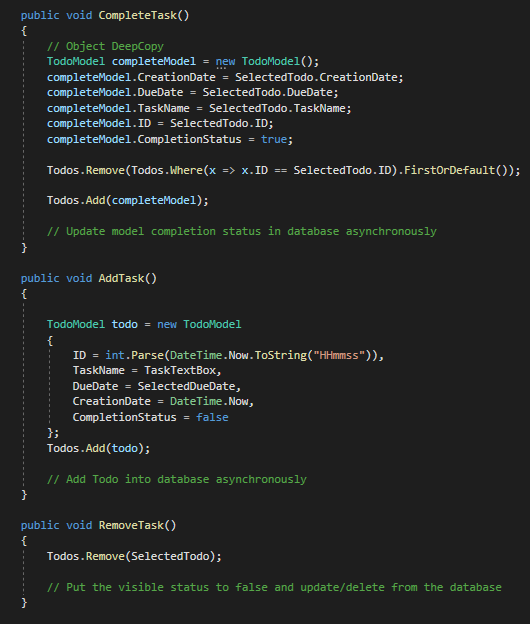
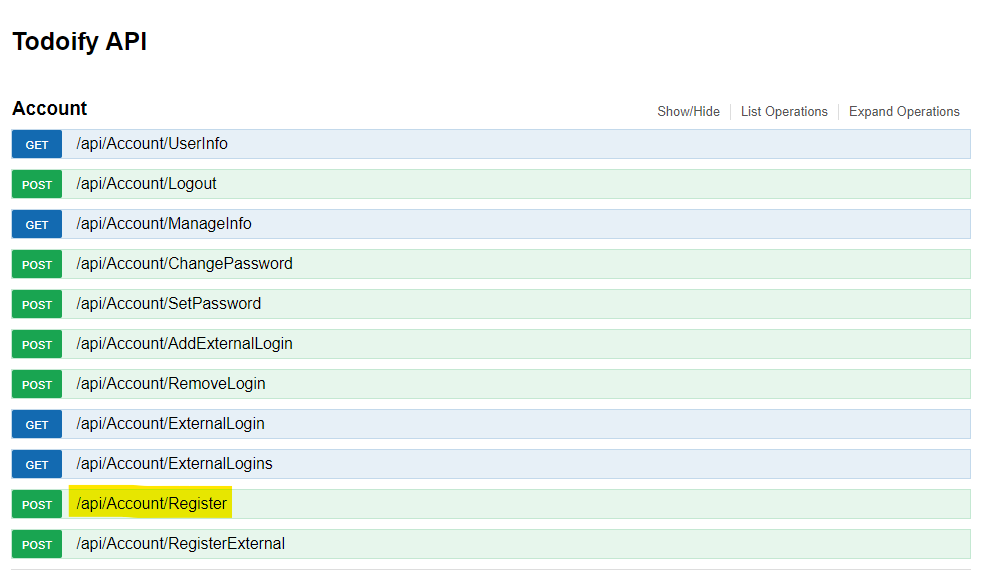
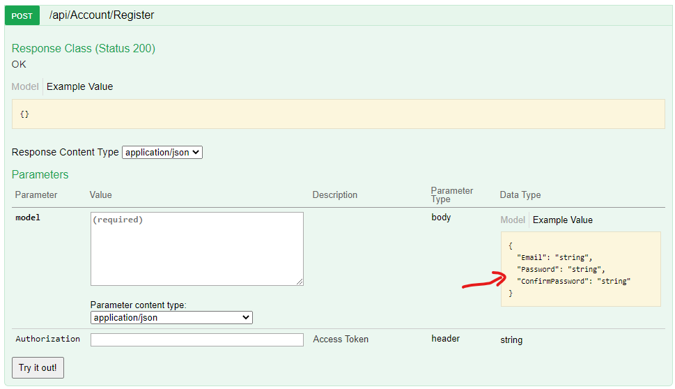
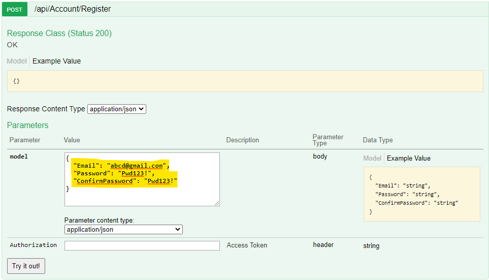

# Todoify Application
This is a simple ToDo application where users have to login and sees the list of tasks and they can add tasks with specified due date, delete task, complete a particular task.

This simple app is divided into front and backend projects. Backend projects contains the API, ClassLibrary and Data class library itself which is just bunch of classes mimicking a database and we have 
front end project contains FrontEnd UI library and WPF application itself.

---
***NOTE: ***
For now, I have only implemented GET feature in API (for all Todo) and in the future we could add PUT, POST, DELETE. I have only updated the models and also mentioned in comments when and where we should add code of PUT, POST, DELETE.

---

## Startup guide

1. Clone the repository 
2. Open it in Visual Studio
3. You can use the following credentials to login to WPF Application which requires login
	1. username: user@vencortex.io
	2. password: Pwd123!
5. If you do not want or cannot use the credentials, then goto https://localhost:PORT/swagger, then click Account and POST /api/Account/Register 

6. After you have registered yourself, you can login in WPF application with your username and password

## Design
The motive for this design is to loosly couple code so that if we want to change front end in the future, it would not effect the backend libraries and API. We might have more leverage in adding and removing components from a system without worrying alot about code rewrite or failure.

## Technologies & Frameworks used
1. .NET Framework 4.8 (in all ClassLibraries & WPF application)
2. Web API MVC (.NET Framework 4.8) with Swagger Implementation
3. Caliburn Micro (for MVVM, Depedency Injection, Binding, Event Aggregator etc.)
4. AutoMapper (simple library for object-to-object mapping library)

### Backend Projects
1. TodoifyData (This classlibrary just mimiks a Database and classes which contains the data).
2. TodoifyDataManager.Library (This classlibrary is just a layer between API and Database i.e TodoifyData. We don't want our API to directly fetch data from Database so this layer which has DataAccess)
3. TodoifyDataManager (This is a Web API which front end Library can use to talk to database, any database operation have to go through an API.)

### Frontend Projects
1. TodoifyUI.Library (This classlibary basically gets the data from API, this library has API helpers)
2. TodofiyWPF (WPF Application which fetches data from TodoifyUI Libaray and knows nothing about the database and backend system, it only talks to UI library, doing this way we could add multiple user interfaces in the future and do 
not have to change the code)
