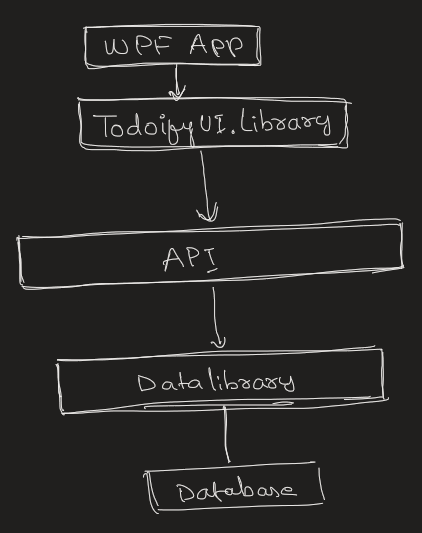

# Todoify Application
This is a simple ToDo application where users have to login and sees the list of tasks and they can add tasks with specified due date, delete task, complete a particular task.

This simple app is divided into front and backend projects. Backend projects contains the API, ClassLibrary and Data class library itself which is just bunch of classes mimicking a database and we have 
front end project contains FrontEnd UI library and WPF application itself.

### Design
The motive for this design is to loosly couple code so that if we want to change front end in the future, it would not effect the backend libraries and API. We might have more leverage in adding and removing components from a system without worrying alot about code rewrite or failure.

### Backend Projects
1. TodoifyData (This classlibrary just mimiks a Database and classes which contains the data).
2- TodofyDataManager.Library (This classlibrary is just a layer between API and Database i.e TodoifyData. We don't want our API to directly fetch data from Database so this layer which has DataAccess )